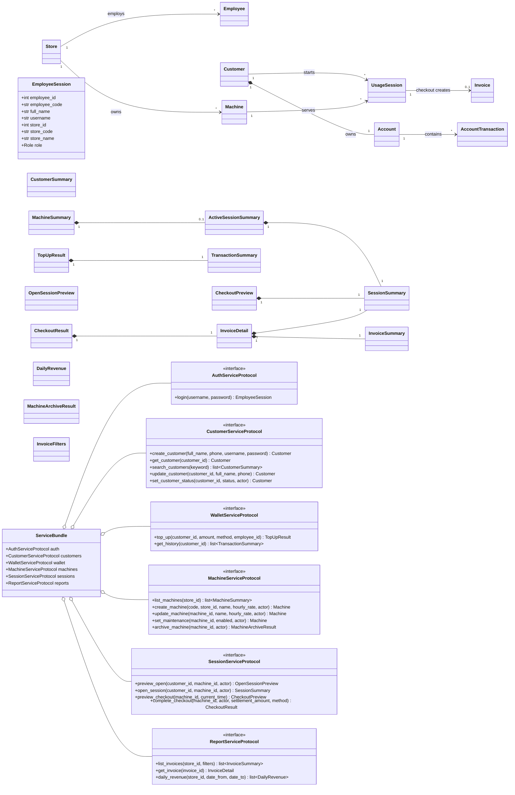

# Class Diagram

```mermaid
classDiagram
    direction LR

    class Store
    class Employee
    class Account
    class Customer
    class Machine
    class UsageSession
    class AccountTransaction
    class Invoice

    class EmployeeSession {
        +int employee_id
        +str employee_code
        +str full_name
        +str username
        +int store_id
        +str store_code
        +str store_name
        +Role role
    }

    class CustomerSummary
    class SessionSummary
    class ActiveSessionSummary
    class MachineSummary
    class TransactionSummary
    class TopUpResult
    class OpenSessionPreview
    class CheckoutPreview
    class InvoiceSummary
    class InvoiceDetail
    class CheckoutResult
    class DailyRevenue
    class MachineArchiveResult
    class InvoiceFilters

    class AuthServiceProtocol {
        <<interface>>
        +login(username, password) EmployeeSession
    }

    class CustomerServiceProtocol {
        <<interface>>
        +create_customer(full_name, phone, username, password) Customer
        +get_customer(customer_id) Customer
        +search_customers(keyword) list~CustomerSummary~
        +update_customer(customer_id, full_name, phone) Customer
        +set_customer_status(customer_id, status, actor) Customer
    }

    class WalletServiceProtocol {
        <<interface>>
        +top_up(customer_id, amount, method, employee_id) TopUpResult
        +get_history(customer_id) list~TransactionSummary~
    }

    class MachineServiceProtocol {
        <<interface>>
        +list_machines(store_id) list~MachineSummary~
        +create_machine(code, store_id, name, hourly_rate, actor) Machine
        +update_machine(machine_id, name, hourly_rate, actor) Machine
        +set_maintenance(machine_id, enabled, actor) Machine
        +archive_machine(machine_id, actor) MachineArchiveResult
    }

    class SessionServiceProtocol {
        <<interface>>
        +preview_open(customer_id, machine_id, actor) OpenSessionPreview
        +open_session(customer_id, machine_id, actor) SessionSummary
        +preview_checkout(machine_id, current_time) CheckoutPreview
        +complete_checkout(machine_id, actor, settlement_amount, method) CheckoutResult
    }

    class ReportServiceProtocol {
        <<interface>>
        +list_invoices(store_id, filters) list~InvoiceSummary~
        +get_invoice(invoice_id) InvoiceDetail
        +daily_revenue(store_id, date_from, date_to) list~DailyRevenue~
    }

    class ServiceBundle {
        +AuthServiceProtocol auth
        +CustomerServiceProtocol customers
        +WalletServiceProtocol wallet
        +MachineServiceProtocol machines
        +SessionServiceProtocol sessions
        +ReportServiceProtocol reports
    }

    Store "1" --> "*" Employee : employs
    Store "1" --> "*" Machine : owns
    Customer "1" *-- "1" Account : owns
    Customer "1" --> "*" UsageSession : starts
    Machine "1" --> "*" UsageSession : serves
    UsageSession "1" --> "0..1" Invoice : checkout creates
    Account "1" --> "*" AccountTransaction : contains

    MachineSummary "1" *-- "0..1" ActiveSessionSummary
    ActiveSessionSummary "1" *-- "1" SessionSummary
    TopUpResult "1" *-- "1" TransactionSummary
    CheckoutPreview "1" *-- "1" SessionSummary
    InvoiceDetail "1" *-- "1" InvoiceSummary
    InvoiceDetail "1" *-- "1" SessionSummary
    CheckoutResult "1" *-- "1" InvoiceDetail

    ServiceBundle o-- AuthServiceProtocol
    ServiceBundle o-- CustomerServiceProtocol
    ServiceBundle o-- WalletServiceProtocol
    ServiceBundle o-- MachineServiceProtocol
    ServiceBundle o-- SessionServiceProtocol
    ServiceBundle o-- ReportServiceProtocol
```